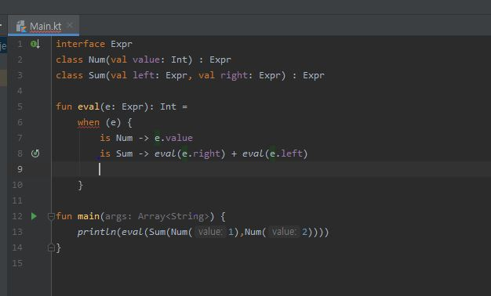

1. When에서 else 없을때 에러 안뜸
-> 뜨는데..?

2. 기본 구현이 있는 코틀린 인터페이스 to java 인터페이스

~~~
코틀린 컴파일러는 해당 함수를 컴파일할때 interface안에 static class로 한번더 wrapping해서 해당 함수를 처리합니다.
~~~

https://tourspace.tistory.com/106

3. 주 생성자 vs 부 생성자
  - 결론적으론 큰 차이는 X 
  - 주 생성자는 property 정의 용도, 부 생성자는 로직 정의 용도
  - You can declare properties in primary constructor, you can define logic in secondary constructor,
and finally you can spread initialization logic through the class using init.

https://discuss.kotlinlang.org/t/difference-between-primary-and-secondary/3277/2
